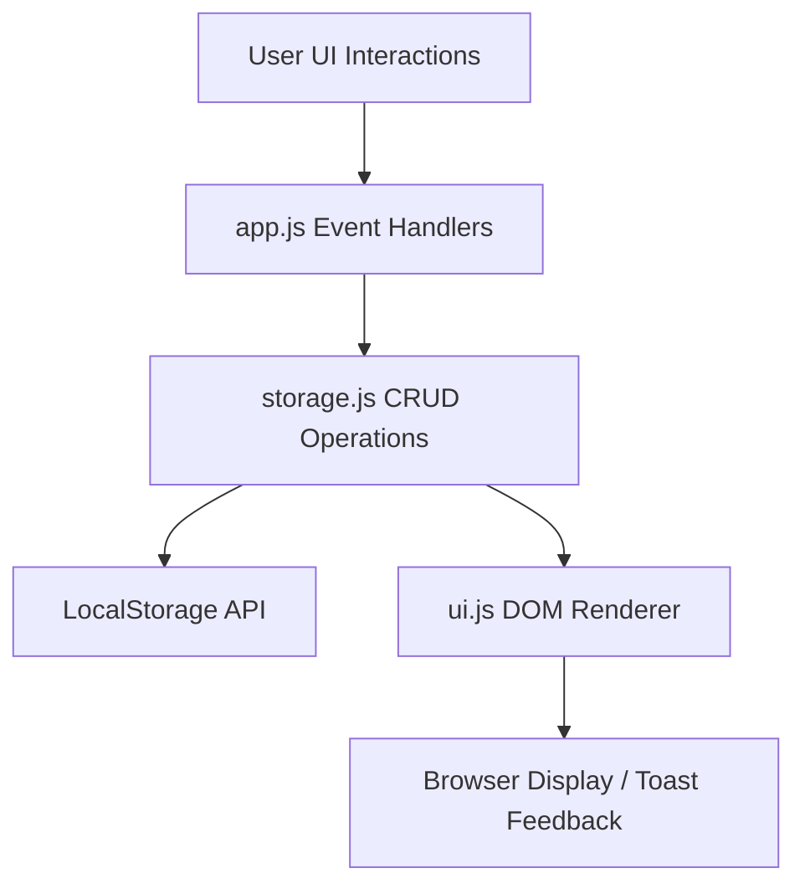

# 📄 Specification Document: Task Manager Web App

**Project:** task-manager  
**Version:** 1.0.0 (MVP)  
**Date:** 2026-08-14  

---

## 1. Executive Summary
Ứng dụng Web App quản lý công việc cá nhân (`task-manager`) thiết kế để tối ưu năng suất làm việc hàng ngày. Đơn giản, siêu nhẹ, giao diện hiện đại với hỗ trợ Dark Mode, LocalStorage Persistence.

## 2. Architecture & Data Flow
- **Architecture:** Client-only Single Page Web Application (SPA).
- **Presentation:** HTML5 + Vanilla CSS (CSS Grid, Flexbox, Custom Properties).
- **Application Logic:** Modular ES6 JavaScript modules (`storage.js`, `ui.js`, `app.js`).
- **Data Persistence:** Browser `window.localStorage` qua key `task_manager_items_v1`.



## 3. Data Schema & Contracts
```typescript
interface TaskItem {
  id: string;            // Unique timestamp ID (e.g., 'task_1723650000000')
  title: string;          // Task title (required, max 120 chars)
  description?: string;   // Optional detailed note
  priority: 'high' | 'medium' | 'low';
  status: 'pending' | 'completed';
  dueDate?: string;       // YYYY-MM-DD format
  createdAt: string;      // ISO 8601 string
}
```

## 4. Feature Specifications & Requirements
1. **CRUD Tasks:** Thêm, xem, sửa, xóa công việc với modal form.
2. **Filter & Search:** Lọc theo All / Pending / Completed và tìm kiếm thời gian thực.
3. **Priority Badges:** Cao (Đỏ/Coral), Trung bình (Vàng/Amber), Thấp (Xanh/Emerald).
4. **Deadline Warning:** Cảnh báo các việc sắp hết hạn hoặc đã quá hạn.
5. **Theme Switcher:** Chuyển đổi giao diện Dark / Light Mode.

---
*Created automatically by AWF /plan workflow.*
